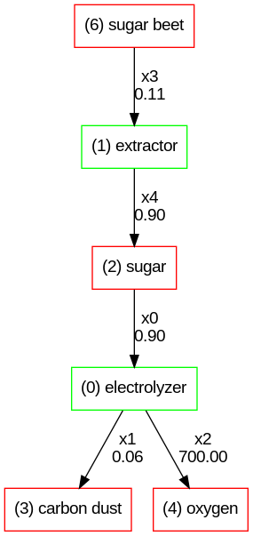
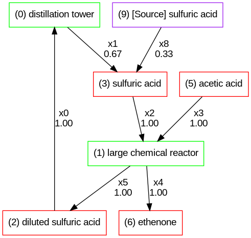

# Steps Towards General GTNH Flow Solving

Machine flow problems in GTNH can be represented as a linear system of equations. See the following problem construction, where each edge in the flowchart represents a variable in the linear system of equations:

<table>
<td>



</td>
<td>

```
SUBJECT TO
_C1: 0.0625 x0 - x1 = 0

_C2: 781.25 x0 - x2 = 0

_C3: 8 x3 - x4 = 0

_C4: - x0 + x4 + x5 - x6 = 0

_C5: x0 = 0.896
```

</td>
</table>

Once the edge values are constructed, the machine counts can be calculated directly from them. For example, if the balanced flowchart needs to output 1000 oxygen/s, and the provider machine produces 500 oxygen/s, then you need 2 of that provider machine.

This works excellently for "simple" scenarios. However, it breaks in two situations:

1. If there are non-fully recycling loops in the machine flow, either you need more initial product, or you need to add more recycling product input. An example below:

<table>
<td>



</td>
<td>

```
_C1: 0.666666666667 x0 - x1 = 0

_C2: x2 - x4 = 0

_C3: x2 - x5 = 0

_C4: x3 - x4 = 0

_C5: x3 - x5 = 0

_C6: - x0 + x5 + x6 - x7 = 0

_C7: x1 - x2 + x8 - x9 = 0

_C8: x0 = 1
```

</td>
</table>

(In this case I chose additional sulfuric acid. I could have also added additional diluted sulfuric acid.)

2. If "parallel" output ratios of a machine are used later in different ratios, then either excess will need to be discarded, or more product added. Example below with naqfuel:

<table>
<td>


</td>
<td>

```
_C1: 3.33333333333 x0 - x2 = 0

_C2: 1.53846153846 x1 - x2 = 0

_C3: 0.1 x3 - x4 = 0

_C4: 0.25 x3 - x5 = 0

_C5: 0.5 x3 - x6 = 0

_C6: 3 x3 - x7 = 0

_C7: - x0 + x5 + x8 - x9 = 0

_C8: - x1 + x10 - x11 + x6 = 0

_C9: x2 = 10
```

</td>
</table>

As you can see, heavy naquadah is produced in excess by the distillation tower, so it needs to be discarded. (Another option would have been to source additional light naquadah fuel from elsewhere.)

As a result, general machine flows in GTNH cannot be represented just as a linear system of equations. However, it is unclear the exact complexity level needed above this.

We need some way to programmatically insert source and sink nodes based on the scenario at hand. We cannot simply observe the chart afterwards and say "there is an excess" as this will not count as a valid solution to the linear system of equations and therefore never be found by the original program.

One solution is to extend the linear system of equations into a linear program, which allows for specifying an objective function. My first approach at solving this problem was:

...